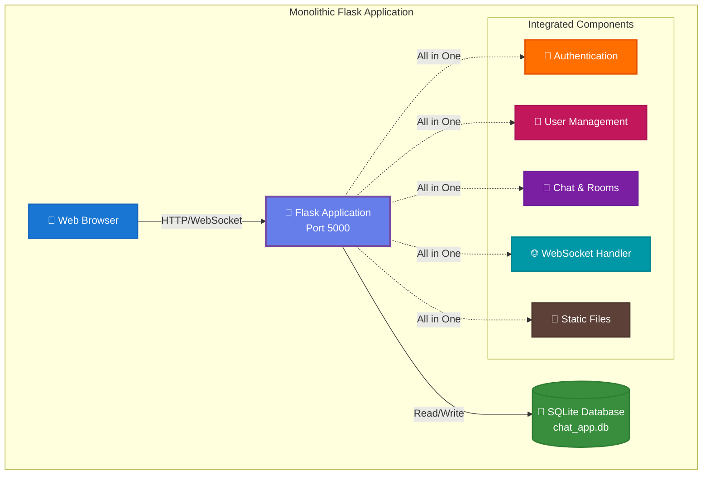
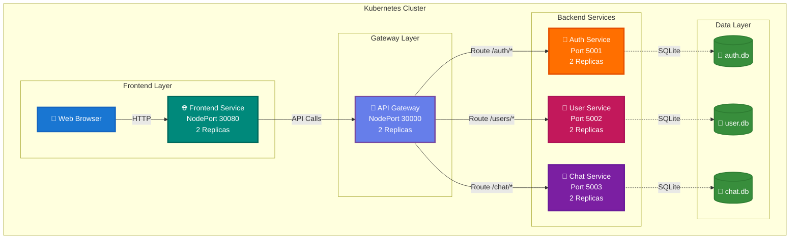
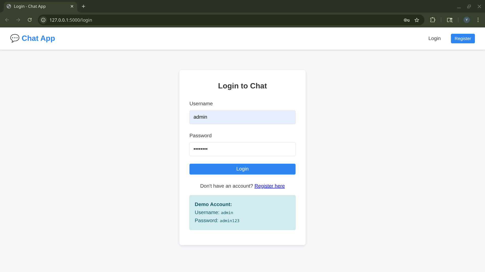
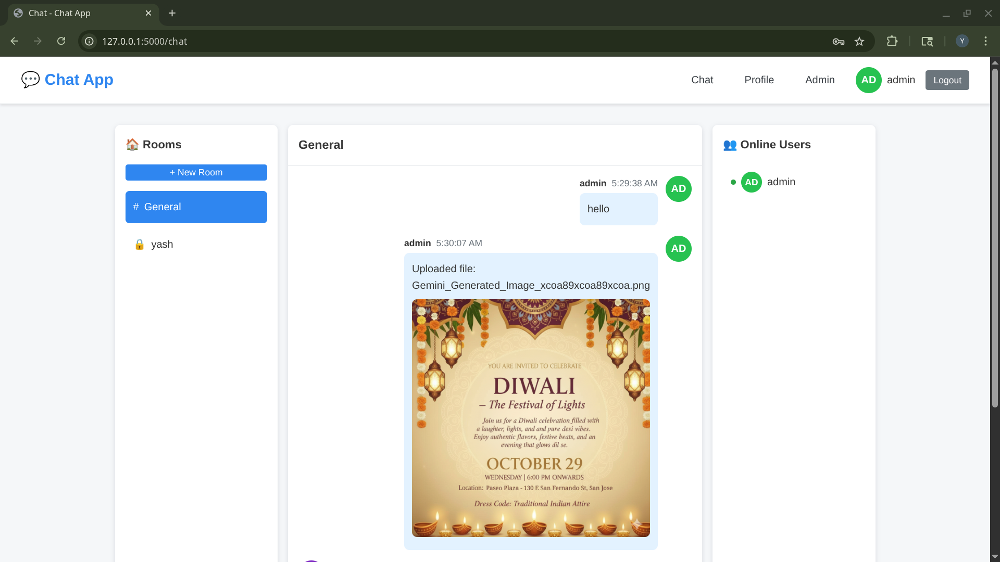
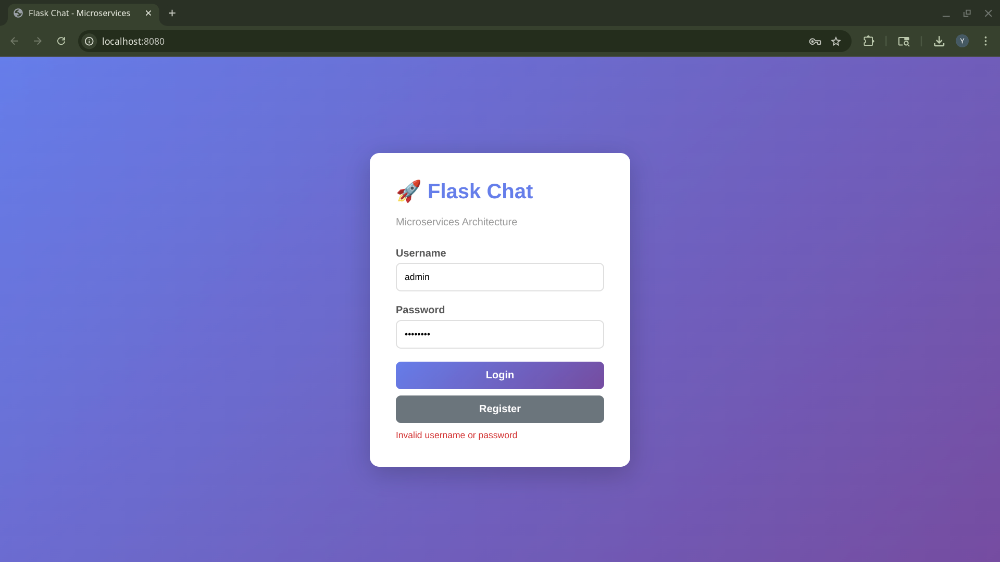
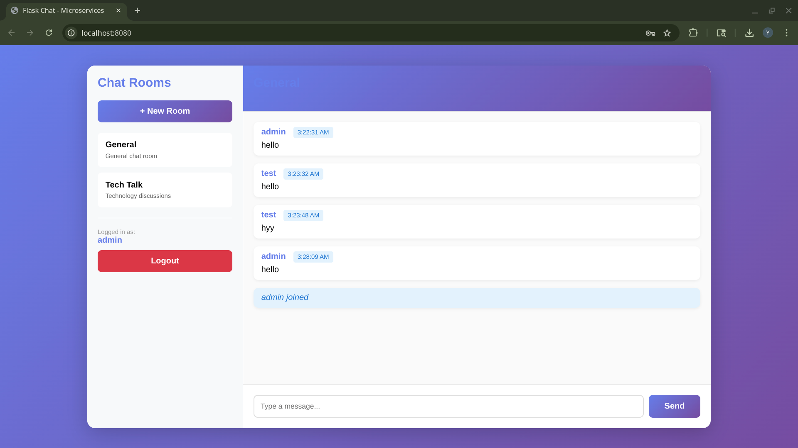
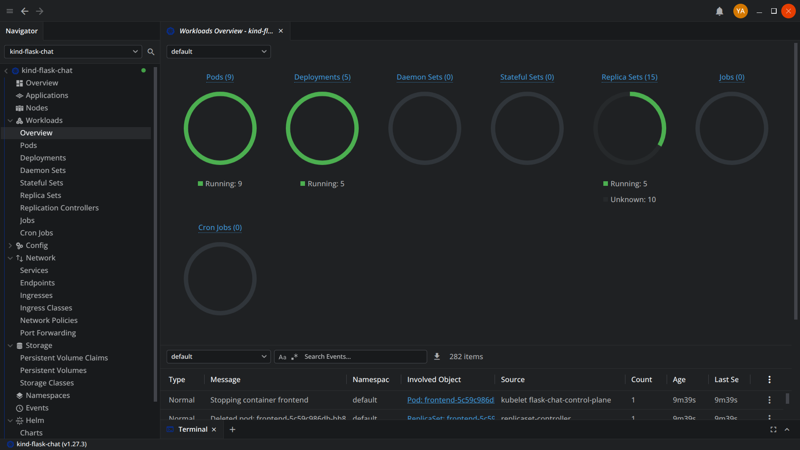
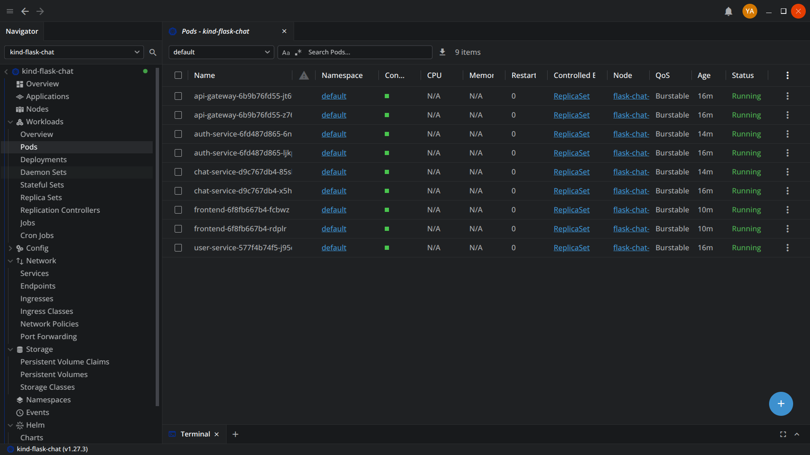

# 🚀 Flask Chat Application - Kubernetes Assignment

## 📋 Table of Contents

- [Overview](#overview)
- [Architecture Evolution](#architecture-evolution)
- [Project Structure](#project-structure)
- [Screenshots](#screenshots)
- [Quick Start](#quick-start)
- [Deliverables](#deliverables)

---

## 🎯 Overview

This project demonstrates the evolution of a Flask-based real-time chat application from a **monolithic architecture** to a **microservices-based architecture** deployed on Kubernetes.

### Key Features

✅ **Monolithic Application** - Single Flask app with all features integrated  
✅ **Microservices Architecture** - 5 independent services  
✅ **Kubernetes Deployment** - Scalable orchestration with Kind  
✅ **Real-time Chat** - WebSocket support for instant messaging  
✅ **JWT Authentication** - Secure token-based auth  
✅ **High Availability** - 2 replicas per service  

---

## 🏗️ Architecture Evolution

### Before: Monolithic Architecture



**Characteristics:**
- Single deployment unit
- Tight coupling between components
- Shared database
- Difficult to scale independently

📂 **Code:** [flask/](flask/)

---

### After: Microservices Architecture



**Characteristics:**
- 5 independent services
- Loose coupling via REST APIs
- Separate databases per service
- Independent scaling
- High availability (2 replicas each)

📂 **Code:** [flask-microservices/](flask-microservices/)

---

## 📁 Project Structure

```
k8/
├── 📂 flask/                          # Monolithic Application
│   ├── app.py                         # Main Flask application
│   ├── Dockerfile                     # Container configuration
│   ├── docker-compose.yml             # Docker Compose setup
│   ├── requirements.txt               # Python dependencies
│   ├── templates/                     # HTML templates
│   ├── static/                        # CSS, JS, images
│   └── README.md                      # Monolith documentation
│
├── 📂 flask-microservices/            # Microservices Application
│   ├── 📂 auth-service/               # Authentication microservice
│   │   ├── app.py
│   │   ├── Dockerfile
│   │   └── requirements.txt
│   │
│   ├── 📂 user-service/               # User management microservice
│   │   ├── app.py
│   │   ├── Dockerfile
│   │   └── requirements.txt
│   │
│   ├── 📂 chat-service/               # Chat & WebSocket microservice
│   │   ├── app.py
│   │   ├── Dockerfile
│   │   └── requirements.txt
│   │
│   ├── 📂 api-gateway/                # API Gateway
│   │   ├── app.py
│   │   ├── Dockerfile
│   │   └── requirements.txt
│   │
│   ├── 📂 frontend/                   # Frontend service
│   │   ├── app.py
│   │   ├── static/index.html
│   │   ├── Dockerfile
│   │   └── requirements.txt
│   │
│   ├── 📂 k8s/                        # Kubernetes Manifests
│   │   ├── auth-service.yaml
│   │   ├── user-service.yaml
│   │   ├── chat-service.yaml
│   │   ├── api-gateway.yaml
│   │   ├── frontend.yaml
│   │   ├── configmap.yaml
│   │   ├── secrets.yaml
│   │   ├── hpa.yaml
│   │   └── ingress.yaml
│   │
│   ├── build-all.sh                   # Build all images
│   ├── deploy-podman.sh               # Podman deployment
│   ├── ARCHITECTURE.md                # Detailed architecture
│   └── README.md                      # Microservices documentation
│
└── README.md                          # This file
```

---

## 📸 Screenshots

### Monolithic Application

#### Login Page

*Clean login interface for the monolithic application*

#### Chat Interface

*Real-time chat with multiple rooms*

---

### Microservices Application

#### Login Page

*Microservices-powered login with JWT authentication*

#### Chat Interface

*Distributed chat system with WebSocket support*

---

### Kubernetes Deployment

#### Pod Status

*All 10 pods running across 5 services (2 replicas each)*

```bash
kubectl get pods
```

#### Service Status


```bash
kubectl get services
```

#### Deployment Overview

*Deployment configurations with replica sets*

```bash
kubectl get deployments
```

---

### Container Images

#### Docker/Podman Images

```bash
podman images | grep -E 'auth-service|user-service|chat-service|api-gateway|frontend'
```

---

## 🚀 Quick Start

### Monolithic Application

```bash
cd flask
source venv/bin/activate
pip install -r requirements.txt
python app.py
# Access: http://localhost:5000
```

📖 **Full Guide:** [flask/README.md](flask/README.md)

---

### Microservices Application

#### Prerequisites
- Docker/Podman
- Kind (Kubernetes in Docker)
- kubectl

#### Deployment

```bash
cd flask-microservices

# For Podman users
./deploy-podman.sh

# Access:
# Frontend: http://localhost:30080
# API Gateway: http://localhost:30000
```

📖 **Full Guide:** [flask-microservices/README.md](flask-microservices/README.md)  
📐 **Architecture Details:** [flask-microservices/ARCHITECTURE.md](flask-microservices/ARCHITECTURE.md)

---

## 📦 Deliverables

| Requirement | Status | Location |
|-------------|--------|----------|
| **Architecture Document** | ✅ Complete | [flask-microservices/ARCHITECTURE.md](flask-microservices/ARCHITECTURE.md) |
| **Kubernetes YAMLs** | ✅ Complete | [flask-microservices/k8s/](flask-microservices/k8s/) |
| **Source Code** | ✅ Complete | [flask/](flask/) & [flask-microservices/](flask-microservices/) |
| **Screenshots** | ✅ Complete | [screenshots/](screenshots/) |
| **Before/After Diagrams** | ✅ Complete | This README |

---

## 🎓 Assignment Compliance

### Rubric Checklist

- [x] **Scale Application** - Decomposed monolith into 5 microservices
- [x] **Reuse Containerized App** - Existing Flask logic refactored and containerized
- [x] **Microservices Architecture** - Clear separation of concerns with REST APIs
- [x] **Deploy on Kubernetes** - Full deployment on Kind cluster
- [x] **Architecture Diagrams** - Before and After diagrams in Mermaid format
- [x] **K8s YAMLs** - Complete manifests for all services
- [x] **Screenshots** - Application and infrastructure screenshots

---

## 🛠️ Technologies Used

### Backend
- **Flask** 2.2.5 - Web framework
- **Flask-SocketIO** 5.3.3 - WebSocket support
- **SQLAlchemy** 2.0.36 - ORM
- **PyJWT** 2.8.0 - JWT authentication

### Infrastructure
- **Kubernetes** (Kind) - Container orchestration
- **Podman/Docker** - Container runtime
- **kubectl** - Kubernetes CLI

### Deployment
- **Kind** - Local Kubernetes cluster
- **NodePort** - External service access
- **ConfigMaps** - Configuration management
- **Secrets** - Sensitive data management

---

## 👤 Author

**Yash Kalathiya**

---

## 📄 License

This project is created for educational purposes as part of a Kubernetes assignment.

---
