# Flask Chat Application - Architecture Document

## Assignment: Microservices & Kubernetes Deployment

**Student:** Yug Kalathiya  
**Date:** November 2025  
**Project:** Scaling Containerized Application with Kubernetes

---

## Table of Contents

1. [Executive Summary](#executive-summary)
2. [Before Architecture (Monolithic)](#before-architecture-monolithic)
3. [After Architecture (Microservices)](#after-architecture-microservices)
4. [Microservices Breakdown](#microservices-breakdown)
5. [Kubernetes Deployment](#kubernetes-deployment)
6. [Communication Patterns](#communication-patterns)
7. [Benefits of Migration](#benefits-of-migration)

---

## Executive Summary

This document outlines the architectural transformation of a Flask-based chat application from a **monolithic architecture** to a **microservices-based architecture** deployed on **Kubernetes (K3s)**.

### Key Achievements:
- ✅ Decomposed monolith into **5 independent microservices**
- ✅ Containerized all services with **Docker/Podman**
- ✅ Deployed on **Kubernetes cluster** with high availability
- ✅ Implemented **service discovery** and **load balancing**
- ✅ Created **health monitoring** and **auto-restart** capabilities

---

## Before Architecture (Monolithic)

### Diagram



```mermaid
flowchart TB
    subgraph Monolith["🏢 MONOLITHIC FLASK APPLICATION"]
        subgraph Process["Single Process (app.py)"]
            direction TB
            subgraph Routes["Flask Routes"]
                Auth["🔐 Authentication<br/>/login<br/>/register<br/>/logout"]
                User["👤 User Management<br/>/profile<br/>/settings<br/>/admin"]
                Chat["💬 Chat Features<br/>/rooms<br/>/messages<br/>/websocket"]
            end
            
            Auth --> DB
            User --> DB
            Chat --> DB
            
            DB[(📁 SQLite Database<br/>chat.db<br/>• users<br/>• messages<br/>• rooms)]
        end
    end
    
    Client[🌐 Web Browser] --> |"HTTP :5000"| Monolith
    
    style Monolith fill:#ffcccc,stroke:#cc0000
    style DB fill:#fff2cc,stroke:#ffcc00
    style Client fill:#cce5ff,stroke:#0066cc
```

**Port:** 5000 | **Database:** Single SQLite file | **Sessions:** Server-side Flask sessions

### Characteristics

| Aspect | Description |
|--------|-------------|
| **Codebase** | Single `app.py` file (~600 lines) |
| **Database** | Single SQLite database (`chat.db`) |
| **Deployment** | Single Docker container |
| **Scaling** | Vertical only (add more CPU/RAM) |
| **Failure Impact** | Entire application fails |
| **Development** | All developers work on same codebase |
| **Technology** | Locked to Flask/Python |

### Problems with Monolithic Architecture

1. **Single Point of Failure** - If any component crashes, entire app is down
2. **Difficult to Scale** - Cannot scale individual features independently
3. **Tight Coupling** - Changes in one area affect others
4. **Long Deployment Cycles** - Must redeploy entire app for any change
5. **Technology Lock-in** - Cannot use different tech for different features
6. **Team Bottlenecks** - Developers block each other

---

## After Architecture (Microservices)

### Diagram



```mermaid
flowchart TB
    subgraph K8s["☸️ KUBERNETES CLUSTER (K3s)"]
        subgraph Ingress["🌐 Ingress Controller"]
            IG[NGINX Ingress]
        end
        
        subgraph Frontend["🖥️ FRONTEND SERVICE"]
            FE["📱 Single Page Application<br/>HTML/CSS/JavaScript<br/>Socket.IO Client"]
        end
        
        subgraph Gateway["🚪 API GATEWAY"]
            GW["🔀 Request Routing<br/>🔐 Auth Proxy<br/>⚖️ Load Balancing<br/>🏥 Health Monitoring"]
        end
        
        subgraph Services["🔧 BACKEND MICROSERVICES"]
            subgraph AuthSvc["Auth Service :5001"]
                AS["🔐 Registration<br/>Login/Logout<br/>JWT Tokens"]
                ADB[(auth.db)]
            end
            
            subgraph UserSvc["User Service :5002"]
                US["👤 Profiles<br/>Settings<br/>Statistics"]
                UDB[(users.db)]
            end
            
            subgraph ChatSvc["Chat Service :5003"]
                CS["💬 Rooms<br/>Messages<br/>WebSocket"]
                CDB[(chat.db)]
            end
        end
        
        subgraph Config["⚙️ CONFIGURATION"]
            Secret["🔒 Secrets<br/>JWT Keys<br/>DB Credentials"]
            CM["📋 ConfigMap<br/>Service URLs<br/>Settings"]
        end
        
        subgraph Scaling["📈 AUTOSCALING"]
            HPA["HPA<br/>2-8 replicas<br/>CPU: 70%"]
        end
    end
    
    Client[🌐 Browser] --> IG
    IG --> FE
    FE --> GW
    GW --> AS
    GW --> US
    GW --> CS
    AS --> ADB
    US --> UDB
    CS --> CDB
    
    Secret -.-> AS
    Secret -.-> US
    Secret -.-> CS
    CM -.-> GW
    HPA -.-> CS
    
    style K8s fill:#e6f3ff,stroke:#0066cc
    style Gateway fill:#fff2cc,stroke:#ffcc00
    style Services fill:#e6ffe6,stroke:#00cc00
    style Config fill:#ffe6e6,stroke:#cc0000
    style Scaling fill:#f0e6ff,stroke:#6600cc
```

### Service Details

| Service | Port | Purpose | Database |
|---------|------|---------|----------|
| **Frontend** | 8080 | Web UI (SPA) | None |
| **API Gateway** | 5000 | Request routing & orchestration | None |
| **Auth Service** | 5001 | Authentication & JWT | auth.db |
| **User Service** | 5002 | Profile management | users.db |
| **Chat Service** | 5003 | Messaging & WebSocket | chat.db |

---

## Microservices Breakdown

### 1. Frontend Service

```
frontend/
├── app.py              # Flask static file server
├── Dockerfile          # Container definition
├── requirements.txt    # Dependencies
└── static/
    └── index.html      # Single Page Application
```

**Responsibilities:**
- Serve static HTML/CSS/JavaScript
- Handle client-side routing
- Manage WebSocket connections to Chat Service
- Provide responsive UI for all devices

**Technology:** Flask + HTML5 + CSS3 + JavaScript + Socket.IO

---

### 2. API Gateway Service

```
api-gateway/
├── app.py              # Gateway implementation
├── Dockerfile          # Container definition
└── requirements.txt    # Dependencies
```

**Responsibilities:**
- Route requests to appropriate microservices
- Aggregate responses from multiple services
- Handle cross-cutting concerns (logging, metrics)
- Provide unified API endpoint

**Routes:**
- `/api/auth/*` → Auth Service
- `/api/users/*` → User Service
- `/api/chat/*` → Chat Service
- `/health` → Aggregated health status

---

### 3. Auth Service

```
auth-service/
├── app.py              # Authentication logic
├── Dockerfile          # Container definition
├── requirements.txt    # Dependencies
└── instance/
    └── auth.db         # User credentials database
```

**Responsibilities:**
- User registration and login
- JWT token generation and validation
- Password hashing (bcrypt)
- Session management

**Endpoints:**
- `POST /register` - Create new user
- `POST /login` - Authenticate user
- `POST /verify` - Validate JWT token
- `GET /users` - List users (admin)
- `GET /health` - Service health check

---

### 4. User Service

```
user-service/
├── app.py              # Profile management
├── Dockerfile          # Container definition
├── requirements.txt    # Dependencies
└── instance/
    └── users.db        # User profiles database
```

**Responsibilities:**
- User profile management
- Preferences and settings
- User statistics
- Avatar management

**Endpoints:**
- `GET /profiles/<id>` - Get user profile
- `PUT /profiles/<id>` - Update profile
- `GET /stats/<id>` - Get user statistics
- `GET /health` - Service health check

---

### 5. Chat Service

```
chat-service/
├── app.py              # Messaging & WebSocket
├── Dockerfile          # Container definition
├── requirements.txt    # Dependencies
└── instance/
    └── chat.db         # Messages database
```

**Responsibilities:**
- Chat room management
- Real-time messaging via WebSocket
- Message persistence
- Online user tracking

**Endpoints:**
- `GET /rooms` - List chat rooms
- `POST /rooms` - Create new room
- `GET /rooms/<id>/messages` - Get room messages
- `WebSocket /socket.io` - Real-time messaging
- `GET /health` - Service health check

---

## Kubernetes Deployment

### Deployment Architecture

```mermaid
flowchart TB
    subgraph K8sCluster["☸️ KUBERNETES CLUSTER"]
        subgraph Deployments["📦 DEPLOYMENTS (replicas: 2)"]
            D1["auth-service<br/>🔐 2 replicas"]
            D2["user-service<br/>👤 2 replicas"]
            D3["chat-service<br/>💬 2 replicas"]
            D4["api-gateway<br/>🚪 2 replicas"]
            D5["frontend<br/>🖥️ 2 replicas"]
        end
        
        subgraph Services["🌐 SERVICES"]
            S1["auth-service<br/>ClusterIP :5001"]
            S2["user-service<br/>ClusterIP :5002"]
            S3["chat-service<br/>ClusterIP :5003"]
            S4["api-gateway<br/>NodePort :30000"]
            S5["frontend<br/>NodePort :30080"]
        end
        
        subgraph ConfigResources["⚙️ CONFIG RESOURCES"]
            SEC["🔒 Secrets"]
            CFG["📋 ConfigMaps"]
            HPA["📈 HPA"]
        end
    end
    
    D1 --> S1
    D2 --> S2
    D3 --> S3
    D4 --> S4
    D5 --> S5
    
    SEC -.-> D1
    SEC -.-> D2
    SEC -.-> D3
    CFG -.-> D4
    HPA -.-> D3
    
    External[🌍 External Traffic] --> S4
    External --> S5
    
    style Deployments fill:#e6f3ff,stroke:#0066cc
    style Services fill:#fff2cc,stroke:#ffcc00
    style ConfigResources fill:#ffe6e6,stroke:#cc0000
```



### Kubernetes Resources

| Resource | Count | Details |
|----------|-------|---------|
| **Deployments** | 5 | One per microservice |
| **Pods** | 5 | Running containers |
| **Services** | 5 | Network endpoints |
| **ClusterIP** | 3 | Internal services |
| **NodePort** | 2 | External access |

### YAML Files

```
k8s/
├── auth-service.yaml    # Auth deployment & service
├── user-service.yaml    # User deployment & service
├── chat-service.yaml    # Chat deployment & service
├── api-gateway.yaml     # Gateway deployment & NodePort
└── frontend.yaml        # Frontend deployment & NodePort
```

---

## Communication Patterns

### Request Flow


### Service Communication

| From | To | Protocol | Purpose |
|------|-----|----------|---------|
| Frontend | API Gateway | HTTP | All API calls |
| Frontend | Chat Service | WebSocket | Real-time messaging |
| API Gateway | Auth Service | HTTP | Authentication |
| API Gateway | User Service | HTTP | Profile data |
| API Gateway | Chat Service | HTTP | Room/message data |
| User Service | Auth Service | HTTP | Token verification |

---

## Benefits of Migration

### Comparison Table

| Aspect | Monolithic | Microservices |
|--------|------------|---------------|
| **Deployment** | All or nothing | Independent per service |
| **Scaling** | Entire app | Individual services |
| **Failure Isolation** | Complete failure | Partial degradation |
| **Technology** | Single stack | Polyglot possible |
| **Team Structure** | Single team | Service teams |
| **Testing** | Integration heavy | Unit test focused |
| **Development Speed** | Slower (conflicts) | Faster (independence) |

### Key Benefits Achieved

1. **Independent Scaling**
   - Scale chat service during peak hours
   - Scale auth service during login surges

2. **Fault Isolation**
   - Chat service crash doesn't affect auth
   - Graceful degradation possible

3. **Technology Freedom**
   - Could use Node.js for real-time features
   - Could use Go for performance-critical services

4. **Faster Deployments**
   - Update auth service without touching chat
   - Smaller, faster CI/CD pipelines

5. **Team Autonomy**
   - Auth team owns auth-service
   - Chat team owns chat-service

---

## Conclusion

The migration from monolithic to microservices architecture successfully achieved:

✅ **5 independent microservices** with clear boundaries  
✅ **Kubernetes orchestration** for container management  
✅ **Service discovery** via K8s services  
✅ **Health monitoring** with liveness/readiness probes  
✅ **Independent databases** for data isolation  
✅ **API Gateway** for unified entry point  
✅ **Real-time capabilities** with WebSocket support  

This architecture provides a solid foundation for future scaling, feature additions, and team growth.

---

## Repository Structure

```
flask-microservices/
├── README.md                 # Project documentation
├── ARCHITECTURE.md           # This document
├── docker-compose.yml        # Local development
├── build-all.sh              # Build all images
├── deploy-all.sh             # Deploy to K8s
├── deploy-k8s.sh             # K8s deployment script
│
├── auth-service/             # Authentication microservice
│   ├── app.py
│   ├── Dockerfile
│   └── requirements.txt
│
├── user-service/             # User profile microservice
│   ├── app.py
│   ├── Dockerfile
│   └── requirements.txt
│
├── chat-service/             # Chat & WebSocket microservice
│   ├── app.py
│   ├── Dockerfile
│   └── requirements.txt
│
├── api-gateway/              # API Gateway microservice
│   ├── app.py
│   ├── Dockerfile
│   └── requirements.txt
│
├── frontend/                 # Frontend web service
│   ├── app.py
│   ├── Dockerfile
│   ├── requirements.txt
│   └── static/
│       └── index.html
│
├── k8s/                      # Kubernetes manifests
│   ├── auth-service.yaml
│   ├── user-service.yaml
│   ├── chat-service.yaml
│   ├── api-gateway.yaml
│   └── frontend.yaml
│
└── k8s-hostnetwork/          # Alternative K8s manifests
    ├── auth-service.yaml
    ├── user-service.yaml
    ├── chat-service.yaml
    ├── api-gateway.yaml
    └── frontend.yaml
```

---

**Document Version:** 1.0  
**Last Updated:** November 2025  
**Author:** Yug Kalathiya
